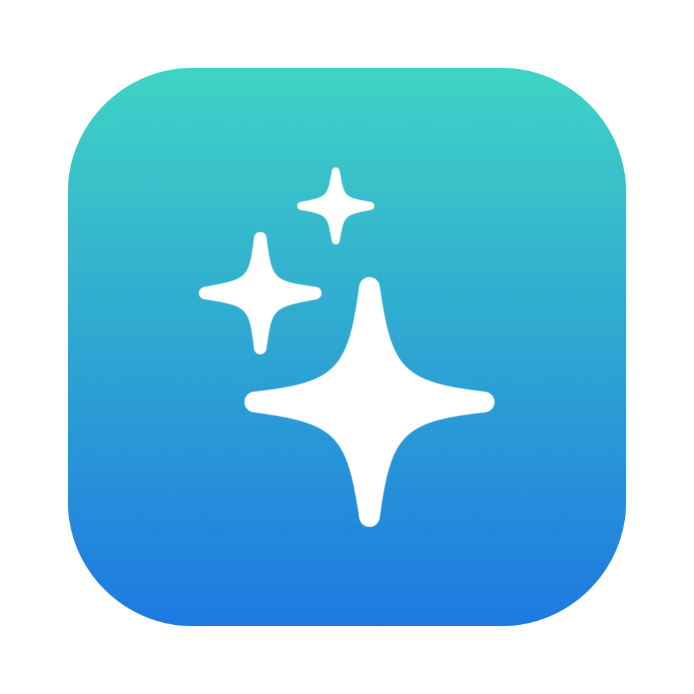
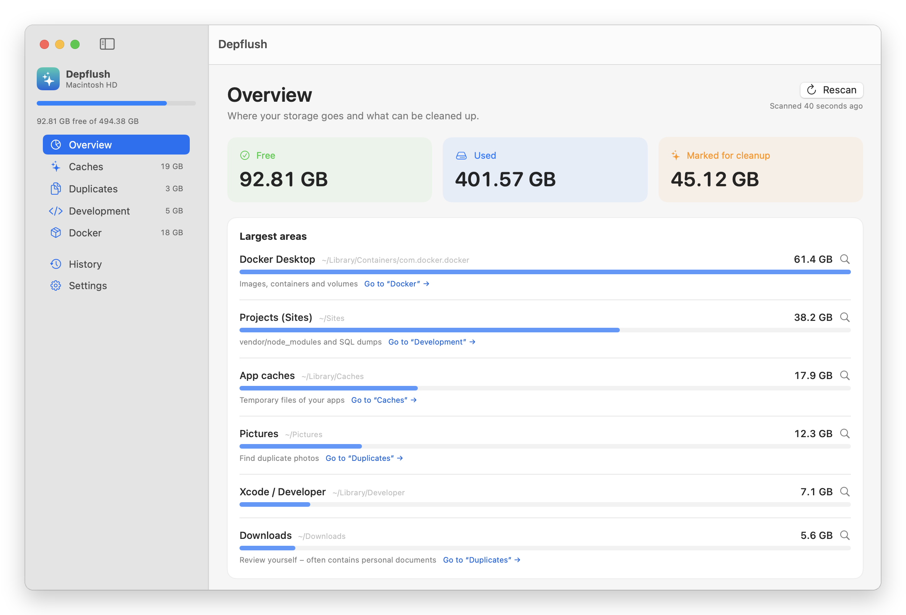
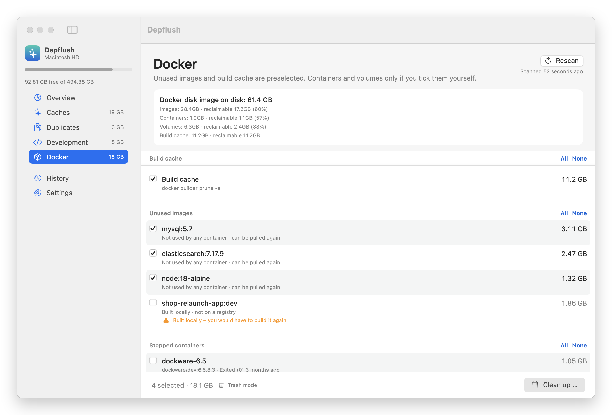
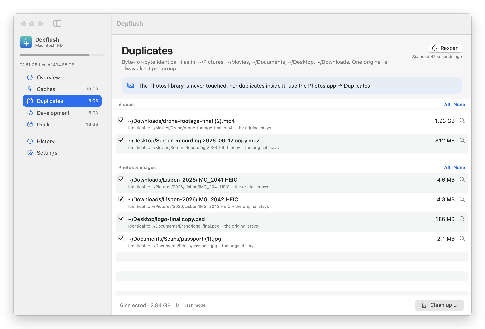

<p align="center"></p>

<h1 align="center">Depflush</h1>

<p align="center">A free Mac app that finds the gigabytes development leaves behind.</p>

<p align="center">
  <a href="https://github.com/cypriennkeneng/depflush/releases/latest">Download</a> ·
  <a href="https://depflush.com">Website</a> ·
  <a href="https://ko-fi.com/depflush">Support on Ko-fi</a>
</p>

Docker images, the `vendor` and `node_modules` folders of projects you haven't touched in a year, duplicate SQL dumps and caches from IDE versions you no longer use. Depflush lists every item with its size before anything moves, and by default everything goes to the Trash.

<p align="center"></p>

On the MacBook it was built on, the first run took free space from **3.5 GB to 95 GB**.

## What it finds

| Area | Details |
|---|---|
| **Docker** | Build cache and unused images that can be pulled again are preselected. Locally built images, stopped containers and orphaned volumes are listed with a warning and never preselected. |
| **Dependencies** | `vendor/` next to a `composer.lock`, `node_modules/` next to a `package.json`, in projects untouched for 12 months (configurable). Restore with `composer install` / `npm install`. |
| **Duplicate files** | Photos and videos in Pictures, Movies, Documents, Desktop and Downloads (folders and "all files from 1 MB" configurable). Compared by size, then first/last bytes, then SHA-256 over the whole file. One original always stays and a copy is only removed if that original is still there. The Photos library, app bundles and app working folders (e.g. CapCut, Final Cut) are never scanned; iCloud files that are not downloaded are skipped, and APFS clones are left out because deleting them frees nothing. |
| **SQL dumps** | Files over 100 MB are compared by size, then SHA-256. Only true duplicates are preselected; the original stays. |
| **Caches** | 30+ locations: browsers, Slack, Discord, VS Code, Cursor, npm, Composer, pnpm, Yarn, pip, Go, Gradle, CocoaPods, Xcode DerivedData, Homebrew, Playwright, Puppeteer, and caches of old JetBrains IDE versions. |

<p align="center">
  
  
</p>

A menu bar item shows your free space and notifies you when it drops below a threshold.

## Safety rules

- Nothing is removed without a preview and your confirmation.
- Trash by default; permanent deletion is an opt-in setting.
- Your home folder, Documents, Desktop, Library and your project folders themselves are protected paths.
- Caches of running apps are locked until you quit the app.
- Risky items (containers, volumes, locally built images, plugin dependencies, duplicates inside app folders) are never preselected.
- No network calls, no analytics, no account.

## Install

With [Homebrew](https://brew.sh):

```sh
brew install --cask cypriennkeneng/tap/depflush
```

Or by hand:

1. Download `Depflush.zip` from the [latest release](https://github.com/cypriennkeneng/depflush/releases/latest), unzip, move Depflush to Applications.
2. Depflush is not notarized by Apple yet. On first launch, open **System Settings → Privacy & Security** and click **Open Anyway**.

Requires macOS 14 Sonoma or later. Runs on Apple Silicon and Intel. English, Deutsch, Français.

## Build from source

No Xcode project and no dependencies. You only need the Xcode Command Line Tools (Swift 6).

```sh
git clone https://github.com/cypriennkeneng/depflush.git
cd depflush
./build.sh            # builds build/Depflush.app (universal binary)
./build.sh --install  # builds, copies to ~/Applications and launches
```

Releases are signed and published by the maintainer; see [docs/RELEASING.md](docs/RELEASING.md).

| Path | Purpose |
|---|---|
| `Sources/Scanners.swift` | Rules: caches, dependencies, SQL dumps, Docker |
| `Sources/CleanerModel.swift` | Scanning, cleanup, history |
| `Sources/Models.swift` | Data types and the code that actually deletes |
| `Sources/Shell.swift` | Shell helpers, sizes, protected paths |
| `Sources/Views.swift`, `MenuBar.swift` | SwiftUI interface |
| `Sources/Strings.swift` | Translations (DE → EN, FR) |

## Contributing

Contributions are welcome, especially new cache locations. See [CONTRIBUTING.md](CONTRIBUTING.md).

## License

The source code is released under the [GNU General Public License v3.0](LICENSE). Copyright © 2026 Web Loupe (Cyprien Nkeneng).

### Name and logo

"Depflush" and the Depflush icon identify the official app published at [depflush.com](https://depflush.com) and in this repository. They are not licensed under the GPL. You are welcome to fork and modify the code under the GPL, but a version you distribute must use a different name and icon and must not suggest that it is the official app or endorsed by Web Loupe. Mentioning that your project is based on Depflush is fine.

Made by [Web Loupe](https://webloupe.de), a Shopware partner in Berlin.
